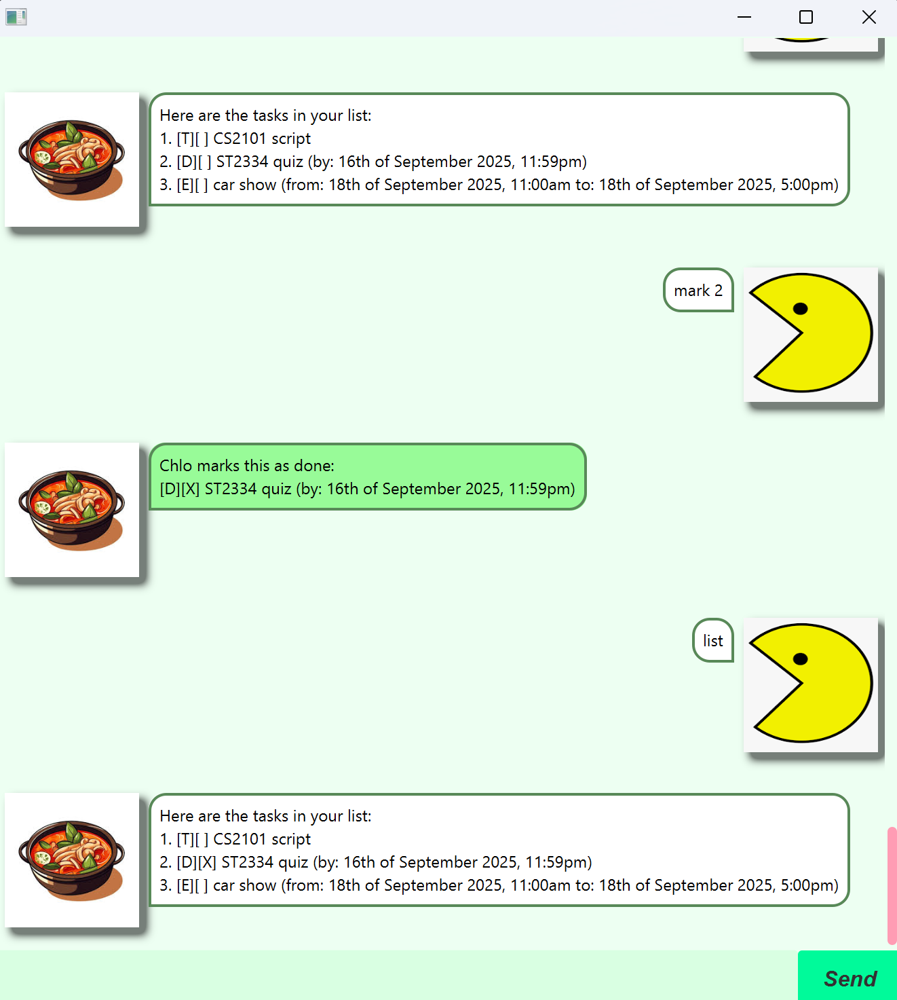

# Chlo User Guide



Hello! I'm Chlo! I help to track your tasks. Including description, date, time. Optimised for users who prefer CLI for keying in information.

## Adding deadlines

Deadline tasks have a timing to complete by. Examples of deadline tasks are:
- ST2334 quiz by 17/6/25 2359
- Assignment 1 by 18/6/25 1400
- Project Chlo by 20/6/25 2359

Usage: `deadline ST2334 quiz /by 17/6/2025 2359`

```
Chlo has added this task:
[D][ ] ST2334 quiz (by: 17th of June 2025, 11:59pm)
Now you have 1 task in the list.
```
## Adding todos

Todo tasks have no timing associated. Examples of todo tasks are:
- Shower
- Call mum
- Drink water

Usage: `todo Shower`

```
Chlo has added this task:
[T][ ] Shower
Now you have 2 tasks in the list.
```
## Adding events

Event tasks have a from and to timing. Examples of Event tasks are:
- Choir auditions from 18/6/2025 2000 to 18/6/2025 2200
- FIN2704 midterms from 19/6/2025 1900 to 19/6/2025 2000
- Coffee chat from 20/6/2025 1500 to 20/6/2025 1600

Usage: `event Choir auditions /from 18/6/2025 2000 /to 18/6/2025 2200`

```
Chlo has added this task:
[E][ ] Choir auditions (from: 18th of June 2025, 8:00pm to: 18th of June 2025, 10:00pm)
Now you have 3 tasks in the list.
```
## Sort feature

Users can sort the tasks in the list to easily identify the upcoming tasks. Deadlines and event tasks are 
prioritised equally, ranked according to earliest from and by time for event and deadline tasks respectively.
Todo tasks are placed at the end. This is logical as todos do not have a timing to complete hence implied as least urgent.

Usage: `sort`

```
Here are the tasks in your list:
[D][ ] ST2334 quiz (by: 17th of June 2025, 11:59pm)
[E][ ] Choir auditions (from: 18th of June 2025, 8:00pm to: 18th of June 2025, 10:00pm)
[D][ ] FIN2704 quiz (by: 16th of September 2025, 11:59pm)
[E][ ] car show (from: 18th of September 2025, 11:00am to: 18th of September 2025, 5:00pm)
[T][ ] CS2101 script
[T][ ] shower
```

## Find feature

Users can find specific tasks using a keyword. All matching instances in any task is flagged out.

Usage: 'find quiz'

```
[D][ ] ST2334 quiz (by: 17th of June 2025, 11:59pm)
[D][ ] FIN2704 quiz (by: 16th of September 2025, 11:59pm)
```

## Mark and Unmark feature

Users can mark and unmark tasks to denote/undo completion.

Usage: `mark 1`
```
Chlo marks this as done:
[D][X] ST2334 quiz (by: 17th of June 2025, 11:59pm)
```
Usage: `unmark 1`
```
Chlo marks this as undone:
[D][ ] ST2334 quiz (by: 17th of June 2025, 11:59pm)
```

## Deleting a task

Users can delete a task.

Usage: `delete 1`
```
Chlo deletes this:
[D][ ] ST2334 quiz (by: 17th of June 2025, 11:59pm)
```